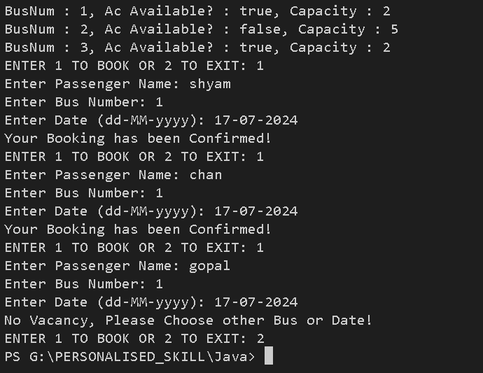

# 🚌 Bus Reservation System

Welcome to the **Bus Reservation System**, a simple command-line application developed in Java that simulates a bus reservation system...

## Features
- **Book Buses Based on Actual Vacancy**: Ensure that bookings are made only if seats are available.
- **Insert Passenger Details**: Add passenger details into buses until their capacity is reached.

## OUTPUT


## Future Goals
- 📂 **Connect to a Database**: Store and retrieve bus and passenger information from a database.
- 📄 **View Bus Details**: Allow users to view detailed information about each bus.
- 🔄 **CRUD Operations**: Implement Create, Read, Update, and Delete operations for buses and bookings.
- 💺 **Multiple Seat Bookings**: Enable booking of multiple seats in a single transaction.

## Getting Started

### Prerequisites
- Java Development Kit (JDK) 8 or higher
- Integrated Development Environment (IDE) like Visual Studio Code or IntelliJ IDEA

### Installation
1. **Clone the repository**:
    ```sh
    git clone https://github.com/shyamshyam018/BusReservationSystem.git
    ```
2. **Navigate to the project directory**:
    ```sh
    cd BusReservationSystem
    ```
3. **Open the project in your IDE**.

### Running the Application
1. **Compile the code**:
    ```sh
    javac src/BusRev/*.java
    ```
2. **Run the application**:
    ```sh
    java src.BusRev.BusDemo
    ```

## Usage
- **Booking a Bus**: Follow the on-screen prompts to book a bus.
- **View Available Buses**: See the list of buses and their current vacancy status.

## Project Structure
```plaintext
BusReservationSystem/
│
├── src/
│   └── BusRev/
│       ├── Bus.java
│       ├── Booking.java
│       └── BusDemo.java
│
└── README.md
```

## Contribution
I welcome contributions to enhance the functionality of this project. Feel free to fork the repository and submit pull requests.

## Contributors

[Chandri02](https://github.com/chandri02)
- **Role:** UI and Feature Engineer
- **Contributions:** Implemented Appealing UI and Developed a new Feature of Search and filter functionality.

### License
This project is licensed under the MIT License.


